# Vikunja MCP behind Cloudflare Access

A small, self-hosted Streamable HTTP MCP server that turns a narrow Vikunja REST API surface into tools for ChatGPT and other remote MCP clients. It is designed for an existing Cloudflare Tunnel and Cloudflare Access Managed OAuth deployment.

It exposes project and task reads, implements a tightly gated write path, and keeps the Vikunja API token on the server.

## AI system overview

```mermaid
flowchart LR
    Client["ChatGPT or another remote MCP client"]
    Access["Cloudflare Access<br/>Managed OAuth and policy"]
    Tunnel["Cloudflare Tunnel"]
    JWKS["Cloudflare Access JWKS"]
    subgraph Origin["Private origin"]
      Adapter["Vikunja MCP adapter<br/>Streamable HTTP at /mcp"]
      Guard["Origin guard<br/>signature, issuer, audience, email"]
      Tools["Narrow MCP tools<br/>writes off by default"]
      ClientLib["Vikunja client abstraction<br/>REST v1 today"]
      Vikunja["Vikunja"]
    end

    Client -->|"OAuth 2.0 authorization code flow"| Access
    Access -->|"Cf-Access-Jwt-Assertion"| Tunnel
    Tunnel --> Adapter
    Adapter --> Guard
    Guard -.->|"fetches rotating signing keys"| JWKS
    Guard --> Tools
    Tools --> ClientLib
    ClientLib -->|"Bearer token stays server-side"| Vikunja

    classDef client fill:#e8f1ff,stroke:#2563eb,color:#172554
    classDef edge fill:#ecfdf5,stroke:#059669,color:#064e3b
    classDef origin fill:#f8fafc,stroke:#64748b,color:#0f172a
    classDef data fill:#fff7ed,stroke:#ea580c,color:#7c2d12
    class Client client
    class Access,Tunnel,JWKS edge
    class Adapter,Guard,Tools,ClientLib origin
    class Vikunja data
```

The public endpoint terminates at Cloudflare. The adapter accepts MCP traffic only after it validates the Access assertion with Cloudflare's rotating JWKS, expected issuer, application audience, and a local email allowlist. The separate Vikunja token never reaches the MCP client.

## Capabilities

| Class | Tools | State |
| --- | --- | --- |
| Read | list_projects, list_tasks, get_task, list_labels | Available |
| Write | create_project, create_task, update_task, complete_task | Implemented, hidden while writes are disabled |
| Labels | Read and assign existing labels by title or ID | Available with writes; never creates labels |
| Excluded | Delete, general sharing, teams, users, bulk changes, label creation | Intentionally unavailable |

The adapter has one Vikunja client abstraction. MCP tools never issue REST calls directly, so a future move away from the current /api/v1 backend is contained in one layer.

## Security model

- Cloudflare Access Managed OAuth authenticates the human user. Cloudflare documents a short Access-token lifetime together with a longer grant session as the normal configuration for non-browser clients.
- The origin does not trust the tunnel alone. It validates the Cf-Access-Jwt-Assertion header's signature through JWKS, issuer, audience, and the authenticated email address.
- Use a dedicated least-privilege Vikunja integration account and API token. Store the token only in the server runtime secret store.
- The container does not publish a host port. It is read-only, drops Linux capabilities, uses no-new-privileges, and has a tmpfs for temporary files.
- `create_project` gives only the configured existing owner account Admin access after creation, so that owner can manage sharing in Vikunja itself. It is not a general project-sharing tool and cannot invite arbitrary people.
- MCP_WRITE_ENABLED is false unless explicitly changed. Even when enabled, writes require an additional identity allowlist.
- A browser Origin header is rejected unless it exactly matches MCP_ALLOWED_ORIGINS. Headerless remote MCP clients remain valid.
- Every Vikunja and JWKS call has a bounded timeout. The adapter deliberately performs no automatic retries, especially never for a write.
- The client follows Vikunja pagination headers but stops at configured page/result caps and returns a truncation indicator instead of silently implying a complete list.
- Vikunja v1 writes use one full, checked task representation. Completing recurring tasks is rejected until that behavior has an explicit end-to-end acceptance test.

## Deployment shape

The example Compose file expects three networks:

- vikunja: an existing private network shared with the Vikunja service.
- mcp-proxy: an internal network shared with the existing Cloudflare Tunnel connector.
- mcp-egress: egress only for refreshing Cloudflare Access signing keys.

The tunnel hostname must route to http://vikunja-mcp:3000. Do not publish port 3000 on the host.

In a single Compose deployment, `cloudflared` and `vikunja-mcp` share an internal bridge directly. If a future deployment separates those Compose projects, create one named bridge once and declare it `external` in both projects; an `internal: true` network is owned by its creating Compose project and cannot be independently recreated with the same semantics.

~~~sh
cp .env.example .env
# Populate only the empty secret and Access fields in your protected runtime copy.
docker compose -f compose.example.yml up -d --build
~~~

Configure a Cloudflare Access application for the MCP hostname and enable Managed OAuth in its advanced settings. Give the Access application a narrow allow policy, set the issuer and Audience tag in the container environment, and use the same intended users in CF_ACCESS_ALLOWED_EMAILS.

Cloudflare's current guidance: [Managed OAuth](https://developers.cloudflare.com/cloudflare-one/access-controls/applications/http-apps/managed-oauth/) and [origin JWT validation](https://developers.cloudflare.com/cloudflare-one/access-controls/applications/http-apps/authorization-cookie/validating-json/).

## Configuration

| Variable | Purpose |
| --- | --- |
| VIKUNJA_BASE_URL | Private Vikunja service base URL, without /api/v1 |
| VIKUNJA_MCP_API_TOKEN | Dedicated Vikunja integration token; secret (development only) |
| VIKUNJA_MCP_API_TOKEN_FILE | Preferred production secret-file path; takes precedence over VIKUNJA_MCP_API_TOKEN |
| VIKUNJA_ALLOWED_PROJECT_IDS | Comma-separated project allowlist, or `all` for every project the integration user can access |
| VIKUNJA_MCP_OWNER_USER_ID | Existing Vikunja user ID automatically given Admin access to new MCP-created projects |
| CF_ACCESS_ISSUER | Cloudflare Access team domain |
| CF_ACCESS_AUDIENCE | Access application Audience tag |
| CF_ACCESS_ALLOWED_EMAILS | Comma-separated origin allowlist |
| MCP_ALLOWED_ORIGINS | Optional comma-separated exact HTTP(S) browser Origins; headerless clients are allowed |
| VIKUNJA_REQUEST_TIMEOUT_MS | Per-call timeout for Vikunja REST requests; default 10000 |
| CF_ACCESS_JWKS_TIMEOUT_MS | Timeout for Cloudflare JWKS refreshes; default 5000 |
| VIKUNJA_PAGE_SIZE / VIKUNJA_MAX_PAGES / VIKUNJA_MAX_RESULTS | Bounded pagination settings; defaults 50 / 20 / 1000 |
| MCP_WRITE_ENABLED | Defaults to false |
| MCP_WRITE_ALLOWED_EMAILS | Required in addition to the feature flag for writes |
| PORT | Listener port, default 3000 |

## Health and operations

- GET /healthz checks that the Node process is live and needs no Access assertion.
- GET /readyz checks Vikunja connectivity and returns 503 when it is unavailable.
- POST /mcp is the only MCP endpoint. Other methods return 405.
- Logs deliberately contain only event names and fixed identifiers. They never include assertions, API tokens, task descriptions, or Vikunja response bodies.

## Development

Node.js 24 is required.

Before making public commits, run `npm run setup:public-git` once in the clone.
It installs the repository pre-push check and configures a non-personal commit
identity for this checkout. `npm run check:public-boundary` also runs in CI.

~~~sh
npm ci
npm test
docker build --tag vikunja-mcp-cloudflare-access:test .
~~~

The test suite covers Access assertion verification, Origin enforcement, stateless Streamable HTTP MCP discovery, read behavior, disabled writes, full-task update serialization, recurrence rejection, existing-label handling, pagination, timeouts, and the REST-client boundary.

## License

[MIT](LICENSE)
